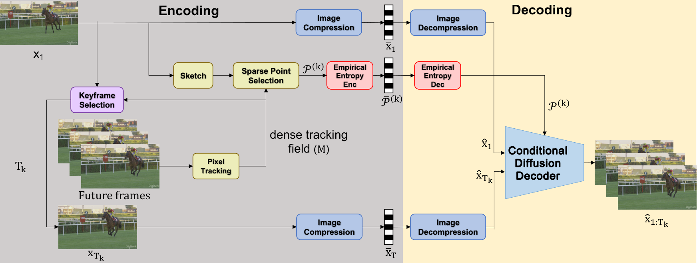
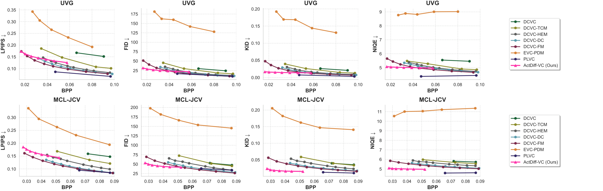

# ActDiff-VC

Official implementation of **"Active Sampling for Ultra-Low-Bit-Rate Video Compression via Conditional Controlled Diffusion"**.

This work is published in *Transactions on Machine Learning Research (TMLR)*, 2026.

[Amirhosein Javadi](https://importamir.github.io), [Shirin Saeedi Bidokhti](https://www.seas.upenn.edu/~saeedi/), [Tara Javidi](https://tjavidi.eng.ucsd.edu)

**[Project website](https://importamir.github.io/ActDiff-VC/) · [Paper](https://arxiv.org/pdf/2605.02849)**

ActDiff-VC is an ultra-low-bitrate video compression framework that combines active sampling with conditional diffusion, using content-adaptive keyframe selection and sparse point trajectories to provide compact yet informative conditioning for generative reconstruction. It substantially reduces the bitrate required to achieve improved perceptual quality over strong learned codecs, and produces visually realistic reconstructions under severe rate constraints.



## Results



LPIPS, FID, KID and NIQE against bits per pixel on UVG and MCL-JCV (lower is better). See the [paper](https://arxiv.org/pdf/2605.02849) and the [project website](https://importamir.github.io/ActDiff-VC/) for qualitative comparisons and ablations.

---

## Setup

The code runs on **Linux with an NVIDIA GPU**. We used a single NVIDIA A100 (40 GB).

### 1. Install Pixi

The environment is managed with [Pixi](https://pixi.sh):

```bash
curl -fsSL https://pixi.sh/install.sh | bash
```

### 2. Clone the repository and its submodules

```bash
git clone https://github.com/importAmir/ActDiff-VC.git
cd ActDiff-VC
pixi run import          # git submodule update --init
```

The submodules in [third_party/](third_party) are Diffusion-as-Shader, AllTracker, HiFiC and MLIC++.

### 3. Create the environment

```bash
pixi install
```

This installs Python 3.10, PyTorch 2.5.1 (CUDA 12.1) and all other dependencies from [pixi.toml](pixi.toml).

### 4. Download the pretrained models

```bash
pixi run login-huggingface         # only needed if Hugging Face downloads fail
pixi run download-all-checkpoints
```

All weights go to `checkpoints/`:

| Model | Used for | Task | Location |
|-------|----------|------|----------|
| Diffusion-as-Shader (CogVideoX-5B) | generative decoder | `download-das-checkpoint` | `checkpoints/Diffusion-As-Shader/` |
| AllTracker | dense point tracking | `download-alltracker-checkpoint` | `checkpoints/alltracker/` |
| HED | edge sketch for point selection | `download-hed-checkpoint` | `checkpoints/hed/` |
| HiFiC (low / med / high) | keyframe codec | `download-hific-checkpoints` | `checkpoints/hific/` |
| MLIC++ | keyframe codec (optional) | `download-mlic-checkpoint` | `checkpoints/mlic/` |
| Inception-I3D | PVCS metric | `download-i3d-weights` | `checkpoints/i3d/` |

---

## Running ActDiff-VC

One command encodes a video, decodes it, and evaluates the reconstruction:

```bash
pixi run compress \
  --video_path path/to/video.mp4 \
  --output_dir outputs/my_video \
  --device cuda:0
```

For raw YUV sequences such as [UVG](https://ultravideo.fi/dataset.html), give the frame size and frame rate. The rest defaults to planar 4:2:0, 8-bit, BT.709 limited range:

```bash
pixi run compress \
  --video_path path/to/Beauty_1920x1080_120fps_420_8bit_YUV.yuv \
  --yuv_width 1920 --yuv_height 1080 --yuv_fps 120 \
  --output_dir outputs/UVG/Beauty
```

Videos are processed at 480×720, the resolution of Diffusion-as-Shader.

### Outputs

Each run gets a short folder name built from its settings: `<keyframe codec>_gop<max GOP length>`, plus a tag for anything else that differs from the defaults. Use `--run_name` to choose your own.

```
outputs/my_video/hific-low_gop49/
├── config.json             # every argument of the run
├── metrics.json            # bpp (keyframe / trajectory split), PSNR, MS-SSIM, LPIPS, tLPIPS, NIQE, FID, KID, PVCS
├── per_frame_metrics.csv
├── reconstruction.mp4
├── comparison.mp4          # original | reconstruction
└── intermediate/           # only with --save_intermediate: keyframes/, tracking/, gops/, plots/
```

The compressed files are written to `--bitstream_dir` (default `bitstream/`). They are deleted once the bit rate has been measured, unless you pass `--keep_bitstream`.

### Main options

| Flag | Meaning | Default |
|------|---------|---------|
| `--num_frames` | Compress only the first N frames of the video | whole video |
| `--keyframe_codec` | Image codec for the keyframes: `hific-low`, `hific-med`, `hific-high`, `mlic` | `hific-low` |
| `--max_gop_length` | Longest GOP in frames, at most 49 (the Diffusion-as-Shader clip length); shorter GOPs raise the bit rate | `49` |
| `--num_trajectories` | Trajectory budget per GOP | `300` |
| `--gop_coverage_threshold` | Adaptive GOP: minimum fraction of a frame covered by the warped keyframe | `0.7` |
| `--gop_lpips_threshold` | Adaptive GOP: maximum masked LPIPS between the warped keyframe and a frame | `0.3` |
| `--gop_patience` | Adaptive GOP: consecutive failing frames before a new keyframe | `3` |
| `--diffusion_steps` | Diffusion denoising steps; 50 gives lower FID / KID but decodes about 2.5x slower | `20` |
| `--save_intermediate` | Also save keyframes, tracking videos, per-GOP videos and plots | off |
| `--keep_bitstream` | Keep the compressed files | off |

Run `pixi run compress --help` for all options, including checkpoint paths and raw-YUV layouts.

## Citation

```bibtex
@article{javadi2026actdiffvc,
  title   = {Active Sampling for Ultra-Low-Bit-Rate Video Compression via Conditional Controlled Diffusion},
  author  = {Javadi, Amirhosein and Saeedi Bidokhti, Shirin and Javidi, Tara},
  journal = {Transactions on Machine Learning Research},
  issn    = {2835-8856},
  year    = {2026},
  url     = {https://arxiv.org/abs/2605.02849}
}
```

## Acknowledgements

This implementation uses Diffusion-as-Shader as the generative decoder, AllTracker for dense point tracking, HiFiC and MLIC++ as keyframe codecs, and HED for the edge sketch that guides point selection (all via `third_party/` and `checkpoints/`). Depth for trajectory rendering comes from ZoeDepth, and the PVCS metric uses an Inception-I3D backbone. The official repositories for those components are:

- Diffusion-as-Shader: [github.com/IGL-HKUST/DiffusionAsShader](https://github.com/IGL-HKUST/DiffusionAsShader)
- AllTracker: [github.com/aharley/alltracker](https://github.com/aharley/alltracker)
- HiFiC (PyTorch implementation): [github.com/Justin-Tan/high-fidelity-generative-compression](https://github.com/Justin-Tan/high-fidelity-generative-compression)
- MLIC++: [github.com/JiangWeibeta/MLIC](https://github.com/JiangWeibeta/MLIC)
- HED: [github.com/s9xie/hed](https://github.com/s9xie/hed)
- ZoeDepth: [github.com/isl-org/ZoeDepth](https://github.com/isl-org/ZoeDepth)
- Inception-I3D (PVCS): [github.com/piergiaj/pytorch-i3d](https://github.com/piergiaj/pytorch-i3d)

Each component keeps its own license.

## License

MIT. See [LICENSE](LICENSE).
